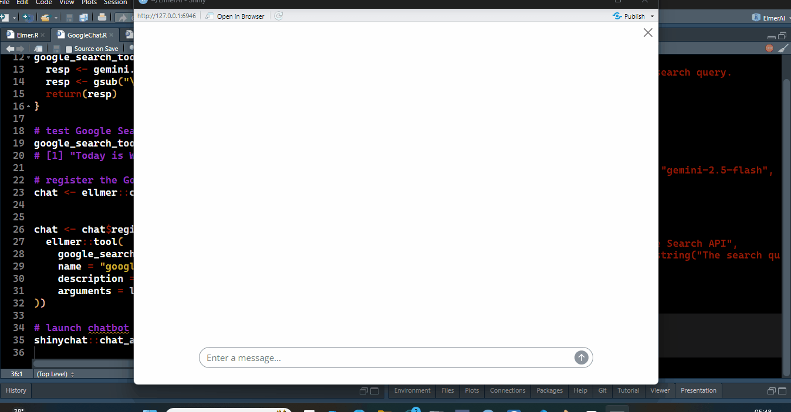

# **GoogleChat**

[](https://www.codefactor.io/repository/github/ifeanyi55/googlechat)
[](https://github.com/Ifeanyi55/GoogleChat/stargazers)
[](https://github.com/Ifeanyi55/GoogleChat/network/members)
[](https://github.com/Ifeanyi55/GoogleChat/issues)
[](https://github.com/Ifeanyi55/GoogleChat/commits/main)
[](https://github.com/Ifeanyi55/GoogleChat)

GoogleChat is an R script that shows how to perform Google Search grounding in Gemini, thereby giving Gemini access to real-time information. Download the R script or follow the steps below to build GoogleChat.

- Step 1: Set your Gemini API key as an environment variable
  
  ```
  Sys.setenv("GEMINI_API_KEY" = "Your_Gemini_API_Key_Here")
  ```

- Step 2: Define a Google Search tool using the [gemini.R](https://github.com/jhk0530/gemini.R) package. Make sure to include the roxygen documentation with "#'".

  ```
  # define the Google Search tool
  #' Fetches data from Google Search API
  #' 
  #' @param query A string representing the search query.
  #' @return The search results as string.
  google_search_tool <- function(query) {
    resp <- gemini.R::gemini_search(query)
    resp <- gsub("\n","", resp)[[1]]
    return(resp)
  }
  ```

- Step 3: Test Google Search tool to make sure it fetches current information

  ```
  google_search_tool("what is today's date?")
  # [1] "Today is Wednesday, September 3, 2025."
  ```

- Step 4: Create chat object with the [Ellmer](https://ellmer.tidyverse.org/) package
  
  ```
  chat <- ellmer::chat_google_gemini(model = "gemini-2.5-flash",
                    api_key = api_key)
  ```

- Step 5: Register the Google Search tool

  ```
  chat <- chat$register_tool(
  ellmer::tool(
    google_search_tool,
    name = "google_search_tool",
    description = "Fetches data from Google Search API",
    arguments = list(query = ellmer::type_string("The search query"))
  ))
  ```

- Step 6: Launch chatbot with the [shinychat](https://posit-dev.github.io/shinychat/) package

  ```
  shinychat::chat_app(chat)
  ```
  


